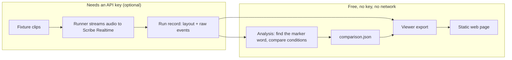

# scribe-timeline

## What

A free, re-runnable check of a bug report about ElevenLabs Scribe v2 Realtime, plus a web
page that replays the evidence.

The report ([elevenlabs-python#849](https://github.com/elevenlabs/elevenlabs-python/issues/849),
filed by [@wujin941005](https://github.com/wujin941005) on 2026-08-19) says that word
timestamps slide later for each automatic (VAD) commit before them. This project ran the
test again on 2026-10-02 and saw the same thing. The original finding belongs to the
reporter. This project adds the runnable code, a dated measurement and the viewer.

Same word, same place in the audio, only the number of commits before it changed:

| condition | strategy | preceding commits | marker returned | delta vs anchor |
| --- | --- | --- | --- | --- |
| `vad_0` | VAD | 0 | 12,200 ms | — (anchor) |
| `vad_1` | VAD | 1 | 12,300 ms | **+100 ms** |
| `vad_2` | VAD | 2 | 12,380 ms | **+180 ms** |
| `manual_2` | manual | 2 | 12,200 ms | **+0 ms** |

Each condition ran three times and all three runs agreed. Offsets do not accumulate when
commits are manual, so the drift comes from the automatic commits.

See it in one click, no login: **<https://sivaratrisrinivas.github.io/scribe-timeline/>**

## Why

The report is well written, but nobody had run it again. Without a runnable test and saved
data, a maintainer can only read about the problem, not see it. It was also possible the
bug had already been fixed.

So this project checks one thing in a way that cannot fool itself: it never compares a
timestamp to where the audio was placed, only the same word's timestamp across conditions.
If the drift had not shown up, that would have been the result, and it would be reported
the same way.

It only covers one model (`scribe_v2_realtime`), English, synthetic audio, and twelve runs
on one day. It says nothing about how often this happens in real use.

## How



The run record is the hand-off point. It holds the audio layout and the raw server events.
Everything after it is plain, repeatable code, so the numbers can be checked without paying
for anything.

Try it:

```sh
git clone https://github.com/sivaratrisrinivas/scribe-timeline.git
cd scribe-timeline
make setup     # installs dependencies and builds the viewer
make check     # runs all tests, no API key needed
make viewer    # opens the viewer locally
```

Re-work out every number above from the saved runs, for free:

```sh
make matrix ARGS="--from-saved evidence/runs/*.json"
```

To record new runs, set `ELEVENLABS_API_KEY` and run `make matrix` (about four minutes of
audio, well under a cent).
